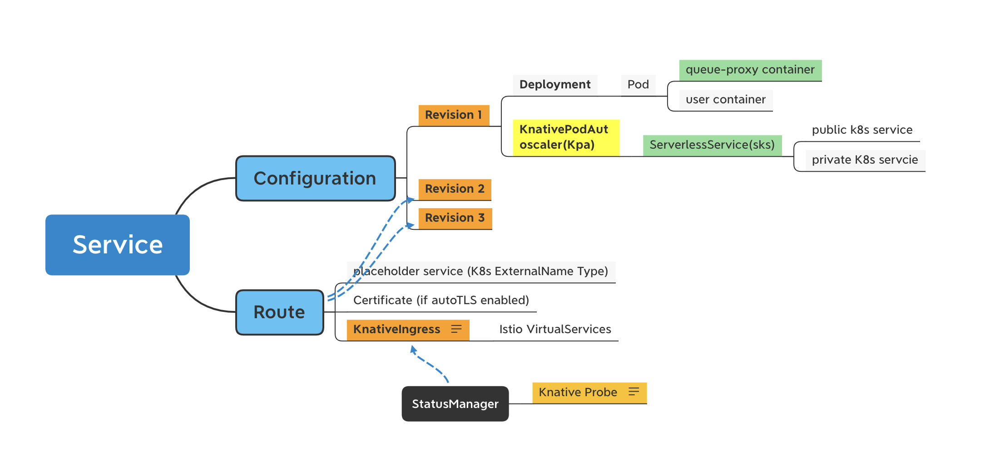
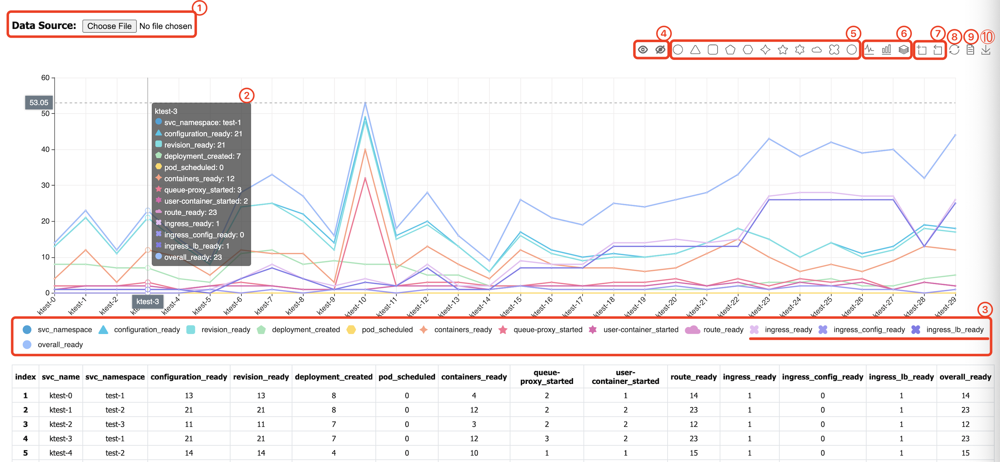

# kperf

[](https://codecov.io/gh/zyjiaobj/kperf)

A Knative Load Test Tool

**Please NOTE this project is under rapid development**.
Kperf is designed for Knative Load test. It helps to generate workload like Knative services and 
gives measurement result about underneath resource create time duration based on server side timestamps, 
and give statics and raw measurement result, to help Knative developers or operators to figure out Knative platform
stability, scalability and performance bottleneck.


# Usage
## Build and install kperf
```cassandraql
# format and build kperf
$ cd {workspace}/src/knative.dev/kperf
$ go get -u github.com/kevinburke/go-bindata/...
$ export PATH=$PATH:$GOPATH/bin
$ ./hack/build.sh

# Move kperf
$ mv kperf /usr/local/bin/
```

Note: [go-bindata](https://github.com/go-bindata/go-bindata) is required in the build process.

## Knative Serving load test

Kperf can help to generate Knative Service Deployment Load in your Knative platform. We assume you have created a
Kubernetes cluster and deployed [Knative Serving](https://knative.dev/docs/install/). 

### Prepare namespaces
Please note that by default kperf assumes you have prepared K8s namespace(s) to create Knative Service. 
If namespace doesn't exist, create it with kubectl as below

```shell script
# Create a namespace for kperf to create Services in it
kubectl create ns {namespace-name}

# Create namespaces from test-1 to test-10 for kperf to create Services distributed in them
for name in {1..10};do kubectl create ns test-$name;done
```

### generate Knative Service deployment load
```shell script
# Generate total 30 knative service, for each 15 seconds create 10 ksvc with 5 concurrency in namespace test-1, test-2
# and test-3, and the ksvc names are ktest-0, ktest-1.....ktest-29.
$ kperf service generate -n 30 -b 10 -c 5 -i 15 --namespace-prefix test --namespace-range 1,3 --svc-prefix ktest --max-scale 1 --min-scale 1

Creating ksvc ktest-0 in namespace test-1
Creating ksvc ktest-1 in namespace test-2
...
...
Creating ksvc ktest-29 in namespace test-3
```

```shell script
# Generate total 30 knative service, for each 15 seconds create 10 ksvc with 1 concurrency in namespace test1, test2 and
# test3, and the ksvc names are ktest-0, ktest-2.....ktest-29. The generation will wait the previous generated service
# to be ready for most 10 seconds.
$ kperf service generate -n 30 -b 10 -c 5 -i 15 --namespace-prefix test --namespace-range 1,3 --svc-prefix ktest --wait --timeout 10s --max-scale 1 --min-scale 1

Creating ksvc ktests-0 in namespace test-1
Creating ksvc ktests-1 in namespace tes-2
...
...
Creating ksvc ktests-29 in namespace test-3
```

### Measure Knative Service deployment time
- Service Configurations Duration Measurement: time duration for Knative Configurations to be ready
- Service Routes Duration Measurement: time duration for Knative Routes to be ready
- Overall Service Ready Measurement: time duration for Knative Service to be ready

Here is a figure of different resources generated for a Knative Service(assuming Istio is the network solution).


**Example 1 Measure Services (for eg. range 1,500)for load test under a specific namespace**

```shell script
$ kperf service measure --namespace ktest-1 --svc-prefix ktest --range 0,9  --verbose --output /tmp
[Verbose] Service ktest-0: Service Configuration Ready Duration is 52s/52.000000s
[Verbose] Service ktest-0: - Service Revision Ready Duration is 52s/52.000000s
[Verbose] Service ktest-0:   - Service Deployment Created Duration is 14s/14.000000s
[Verbose] Service ktest-0:     - Service Pod Scheduled Duration is 0s/0.000000s
[Verbose] Service ktest-0:     - Service Pod Containers Ready Duration is 16s/16.000000s
[Verbose] Service ktest-0:       - Service Pod queue-proxy Started Duration is 11s/11.000000s
[Verbose] Service ktest-0:       - Service Pod user-container Started Duration is 9s/9.000000s
[Verbose] Service ktest-0:   - Service PodAutoscaler Active Duration is 37s/37.000000s
[Verbose] Service ktest-0:     - Service ServerlessService Ready Duration is 17s/17.000000s
[Verbose] Service ktest-0:       - Service ServerlessService ActivatorEndpointsPopulated Duration is 0s/0.000000s
[Verbose] Service ktest-0:       - Service ServerlessService EndpointsPopulated Duration is 17s/17.000000s
[Verbose] Service ktest-0: Service Route Ready Duration is 54s/54.000000s
[Verbose] Service ktest-0: - Service Ingress Ready Duration is 2s/2.000000s
[Verbose] Service ktest-0:   - Service Ingress Network Configured Duration is 0s/0.000000s
[Verbose] Service ktest-0:   - Service Ingress LoadBalancer Ready Duration is 2s/2.000000s
[Verbose] Service ktest-0: Overall Service Ready Duration is 54s/54.000000s
......
-------- Measurement --------
Total: 10 | Ready: 10 NotReady: 0 NotFound: 0 Fail: 0
Service Configuration Duration:
Total: 251.000000s
Average: 25.100000s
- Service Revision Duration:
  Total: 248.000000s
  Average: 24.800000s
  - Service Deployment Created Duration:
    Total: 91.000000s
    Average: 9.100000s
    - Service Pod Scheduled Duration:
      Total: 0.000000s
      Average: 0.000000s
    - Service Pod Containers Ready Duration:
      Total: 111.000000s
      Average: 11.100000s
      - Service Pod queue-proxy Started Duration:
        Total: 53.000000s
        Average: 5.300000s
      - Service Pod user-container Started Duration:
        Total: 40.000000s
        Average: 4.000000s
  - Service PodAutoscaler Active Duration:
    Total: 152.000000s
    Average: 15.200000s
    - Service ServerlessService Ready Duration:
      Total: 100.000000s
      Average: 10.000000s
      - Service ServerlessService ActivatorEndpointsPopulated Duration:
        Total: 1.000000s
        Average: 0.100000s
      - Service ServerlessService EndpointsPopulated Duration:
        Total: 100.000000s
        Average: 10.000000s

Service Route Ready Duration:
Total: 310.000000s
Average: 31.000000s
- Service Ingress Ready Duration:
  Total: 57.000000s
  Average: 5.700000s
  - Service Ingress Network Configured Duration:
    Total: 0.000000s
    Average: 0.000000s
  - Service Ingress LoadBalancer Ready Duration:
    Total: 57.000000s
    Average: 5.700000s

-----------------------------
Overall Service Ready Measurement:
Total: 10 | Ready: 10 (100.00%)  NotReady: 0 (0.00%)  NotFound: 0 (0.00%) Fail: 0 (0.00%)
Total: 310.000000s
Average: 31.000000s
Median: 28.000000s
Min: 16.000000s
Max: 54.000000s
Percentile50: 27.000000s
Percentile90: 49.000000s
Percentile95: 51.500000s
Percentile98: 51.500000s
Percentile99: 51.500000s
Raw Timestamp saved in CSV file /tmp/20210117104747_raw_ksvc_creation_time.csv
Measurement saved in CSV file /tmp/20210117104747_ksvc_creation_time.csv
Visualized measurement saved in HTML file /tmp/20210117104747_ksvc_creation_time.html

$ cat /tmp/20210117104747_ksvc_creation_time.csv                                        
svc_name,svc_namespace,configuration_ready,revision_ready,deployment_created,pod_scheduled,containers_ready,queue-proxy_started,user-container_started,route_ready,kpa_active,sks_ready,sks_activator_endpoints_populated,sks_endpoints_populated,ingress_ready,ingress_config_ready,ingress_lb_ready,overall_ready
ktest-0,ktest-1,52,52,14,0,16,11,9,54,37,17,0,17,2,0,2,54
ktest-1,ktest-1,25,25,12,0,13,8,5,32,13,12,1,12,7,0,7,32
ktest-2,ktest-1,20,20,13,0,6,3,2,25,7,5,0,5,4,0,4,25
ktest-3,ktest-1,22,22,14,0,6,2,2,27,7,4,0,4,5,0,5,27
ktest-4,ktest-1,47,47,9,0,20,11,9,49,37,18,0,18,2,0,2,49
ktest-5,ktest-1,21,20,9,0,11,2,1,29,11,9,0,9,7,0,7,29
ktest-6,ktest-1,24,24,8,0,15,8,6,32,15,14,0,14,8,0,8,32
ktest-7,ktest-1,14,14,8,0,4,2,2,21,5,3,0,3,7,0,7,21
ktest-8,ktest-1,17,16,2,0,14,4,2,25,14,13,0,13,8,0,8,25
ktest-9,ktest-1,9,8,2,0,6,2,2,16,6,5,0,5,7,0,7,16
```

### Clean Knative Service generated for test
```shell script
# Delete all ksvc with name prefix ktest in namespaces with name prefix test and index 1,2,3
$ kperf service clean --namespace-prefix test --namespace-range 1,3 --svc-prefix ktest

Delete ksvc ktest-0 in namespace test-1
Delete ksvc ktest-2 in namespace test-1
...
Delete ksvc ktests-1 in namespace test-2
Delete ksvc ktests-10 in namespace test-2
...
Delete ksvc ktests-5 in namespace test-3
Delete ksvc ktests-8 in namespace test-3
```

### Analyze load test result through Dashboard

A visualized result is automatically generated by kperf during the measurement step to make the measurement data to be intuitive, which is a static HTML file including a chart and a table.



As we will have tons of measurement metrics for a single test (e.g. `revision_ready`, `configuration_ready`, `ingress_ready` and etc.), it’s important to pick some key measurement metrics to analyze the bottleneck of the Knative service creation lifecycle.

The kperf dashboard enables to select or unselect the metrics to be observed, that will be much easier for developers to find out the most time consuming operations during the service creation. Besides, the kperf dashboard supports zooming in/out the data, developers can choose the full set of the data or only a subset of the data to observe.

The kperf dashboard is built based on an open source charting library [ECharts](https://echarts.apache.org/en/index.html), we are taking advantage of the rich features provided by this library, and also extend it's functionality by implementing some custom tools.

Detailed description about the usage of the kperf dashboard:

1. **Select Data Source** : choose another CSV file from local to be rendered in the page.

2. **Value** : hover on the chart area to see detailed metric values under the same x axis.

3. **Legend** : click on the legend to show/hide the metric line/bar in the chart. Metrics are auto-grouped by it's name prefix before the `_` symbol, e.g. in this sample chart, metrics `ingress_ready` `ingress_config_ready` and `ingress_lb_ready` are grouped together and assigned with a group icon ✤.

4. Toolbox **Select/Unselect All** : click on 'select/unselect all' icon of the toolbox to show/hide all of the metric lines/bars in the chart.

5. Toolbox **Select Group** : click on any 'group' icon of the toolbox to show the metric lines/bars under the target group in the chart and hide others.

6. Toolbox **Switch Chart Type** : switch chart type between `line` and `bar`, `staked bar` and `unstacked bar`, `tiled line` and `untiled line`.

7. Toolbox **Data Zoom** : enable to select a specific area to be zoomed in/out.

8. Toolbox **Restore** : restore to initial chart configuration after switching chart type, data zooming and etc.

9. Toolbox **Data View** : display raw data in current chart and update chart after being edited.

10. Toolbox **Save as Image** : save current chart view as an image.
