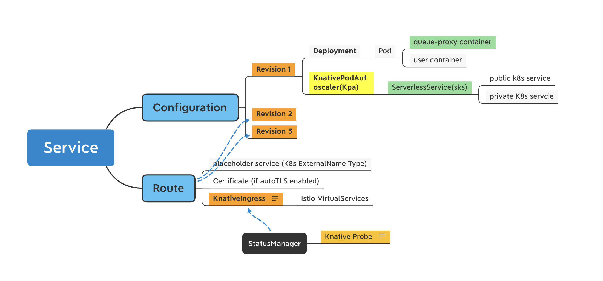

# Using Kperf

* [Serving load test](#knative-serving-load-test)
    * [Prepare namespaces](#prepare-namespaces)
    * [Generate deployment load](#Generate-knative-service-deployment-load)
    * [Measure deployment time](#measure-knative-dervice-deployment-time)
    * [Clean up](#clean-knative-service-generated-for-test)
    * [Analyze results with Dashboard](#analyze-load-test-result-through-dashboard)
    * [Measure scale from zero](#scale-from-zero-and-measure-knative-service-latency)
    * [Measure scale up latency under load](#scale-from-0-to-n-using-load-test-tool-and-measure-scale-up-latency)

## Knative Serving load test

Kperf can help to generate Knative Service Deployment Load in your Knative platform. We assume you have created a
Kubernetes cluster and deployed [Knative Serving](https://knative.dev/docs/install/).

### Prepare namespaces
Please note that by default kperf assumes you have prepared K8s namespace(s) to create Knative Service.
If namespace doesn't exist, create it with kubectl as below

```shell script
# Create a namespace for kperf to create Services in it
kubectl create ns {namespace-name}

# Create namespaces from test-1 to test-10 for kperf to create Services distributed in them
for name in {1..10};do kubectl create ns test-$name;done
```

### Generate Knative Service deployment load
- Use config file to specify flags
  - Create `~/.config/kperf/config.yaml` and specify flags in it
  - Use the `config.yaml` in generate command

```yaml
# config file
service:
  generate:
    number: 10
    interval: 10
    batch: 10
    concurrency: 5
    namespace: test
    namespace-prefix:
    namespace-range:
    svc-prefix: ktest
    min-scale: 0
    max-scale: 0
```

```shell script
# create and write config file
$ vim ~/.config/kperf/config.yaml

# Use the config.yaml in generate command
# Generate total 10 knative service, for each 10 seconds create 10 ksvc with 5 concurrency in namespace test
# and the ksvc names are ktest-0, ktest-1.....ktest-9.
$ kperf service generate --config ~/.config/kperf/config.yaml

Creating Knative Service ktest-4 in namespace test
Creating Knative Service ktest-0 in namespace test

Creating Knative Service ktest-9 in namespace test
```

- Use command to specify flags

```shell script
# Generate total 30 knative service, for each 15 seconds create 10 ksvc with 5 concurrency in namespace test-1, test-2
# and test-3, and the ksvc names are ktest-0, ktest-1.....ktest-29.
$ kperf service generate -n 30 -b 10 -c 5 -i 15 --namespace-prefix test --namespace-range 1,3 --svc-prefix ktest --max-scale 1 --min-scale 1

Creating ksvc ktest-0 in namespace test-1
Creating ksvc ktest-1 in namespace test-2
...
...
Creating ksvc ktest-29 in namespace test-3
```

```shell script
# Generate total 30 knative service, for each 15 seconds create 10 ksvc with 1 concurrency in namespace test1, test2 and
# test3, and the ksvc names are ktest-0, ktest-2.....ktest-29. The generation will wait the previous generated service
# to be ready for most 10 seconds.
$ kperf service generate -n 30 -b 10 -c 5 -i 15 --namespace-prefix test --namespace-range 1,3 --svc-prefix ktest --wait --timeout 10s --max-scale 1 --min-scale 1

Creating ksvc ktests-0 in namespace test-1
Creating ksvc ktests-1 in namespace tes-2
...
...
Creating ksvc ktests-29 in namespace test-3
```

### Measure Knative Service deployment time
- Service Configurations Duration Measurement: time duration for Knative Configurations to be ready
- Service Routes Duration Measurement: time duration for Knative Routes to be ready
- Overall Service Ready Measurement: time duration for Knative Service to be ready

Here is a figure of different resources generated for a Knative Service(assuming Istio is the network solution).


**Example 1 Measure Services (for eg. range 1,500)for load test under a specific namespace**

```shell script
$ kperf service measure --namespace ktest-1 --svc-prefix ktest --range 0,9  --verbose --output /tmp
[Verbose] Service ktest-0: Service Configuration Ready Duration is 52s/52.000000s
[Verbose] Service ktest-0: - Service Revision Ready Duration is 52s/52.000000s
[Verbose] Service ktest-0:   - Service Deployment Created Duration is 14s/14.000000s
[Verbose] Service ktest-0:     - Service Pod Scheduled Duration is 0s/0.000000s
[Verbose] Service ktest-0:     - Service Pod Containers Ready Duration is 16s/16.000000s
[Verbose] Service ktest-0:       - Service Pod queue-proxy Started Duration is 11s/11.000000s
[Verbose] Service ktest-0:       - Service Pod user-container Started Duration is 9s/9.000000s
[Verbose] Service ktest-0:   - Service PodAutoscaler Active Duration is 37s/37.000000s
[Verbose] Service ktest-0:     - Service ServerlessService Ready Duration is 17s/17.000000s
[Verbose] Service ktest-0:       - Service ServerlessService ActivatorEndpointsPopulated Duration is 0s/0.000000s
[Verbose] Service ktest-0:       - Service ServerlessService EndpointsPopulated Duration is 17s/17.000000s
[Verbose] Service ktest-0: Service Route Ready Duration is 54s/54.000000s
[Verbose] Service ktest-0: - Service Ingress Ready Duration is 2s/2.000000s
[Verbose] Service ktest-0:   - Service Ingress Network Configured Duration is 0s/0.000000s
[Verbose] Service ktest-0:   - Service Ingress LoadBalancer Ready Duration is 2s/2.000000s
[Verbose] Service ktest-0: Overall Service Ready Duration is 54s/54.000000s
......
-------- Measurement --------
Total: 10 | Ready: 10 NotReady: 0 NotFound: 0 Fail: 0
Service Configuration Duration:
Total: 251.000000s
Average: 25.100000s
- Service Revision Duration:
  Total: 248.000000s
  Average: 24.800000s
  - Service Deployment Created Duration:
    Total: 91.000000s
    Average: 9.100000s
    - Service Pod Scheduled Duration:
      Total: 0.000000s
      Average: 0.000000s
    - Service Pod Containers Ready Duration:
      Total: 111.000000s
      Average: 11.100000s
      - Service Pod queue-proxy Started Duration:
        Total: 53.000000s
        Average: 5.300000s
      - Service Pod user-container Started Duration:
        Total: 40.000000s
        Average: 4.000000s
  - Service PodAutoscaler Active Duration:
    Total: 152.000000s
    Average: 15.200000s
    - Service ServerlessService Ready Duration:
      Total: 100.000000s
      Average: 10.000000s
      - Service ServerlessService ActivatorEndpointsPopulated Duration:
        Total: 1.000000s
        Average: 0.100000s
      - Service ServerlessService EndpointsPopulated Duration:
        Total: 100.000000s
        Average: 10.000000s

Service Route Ready Duration:
Total: 310.000000s
Average: 31.000000s
- Service Ingress Ready Duration:
  Total: 57.000000s
  Average: 5.700000s
  - Service Ingress Network Configured Duration:
    Total: 0.000000s
    Average: 0.000000s
  - Service Ingress LoadBalancer Ready Duration:
    Total: 57.000000s
    Average: 5.700000s

-----------------------------
Overall Service Ready Measurement:
Total: 10 | Ready: 10 (100.00%)  NotReady: 0 (0.00%)  NotFound: 0 (0.00%) Fail: 0 (0.00%)
Total: 310.000000s
Average: 31.000000s
Median: 28.000000s
Min: 16.000000s
Max: 54.000000s
Percentile50: 27.000000s
Percentile90: 49.000000s
Percentile95: 51.500000s
Percentile98: 51.500000s
Percentile99: 51.500000s
Raw Timestamp saved in CSV file /tmp/20210117104747_raw_ksvc_creation_time.csv
Measurement saved in CSV file /tmp/20210117104747_ksvc_creation_time.csv
Visualized measurement saved in HTML file /tmp/20210117104747_ksvc_creation_time.html

$ cat /tmp/20210117104747_ksvc_creation_time.csv
svc_name,svc_namespace,configuration_ready,revision_ready,deployment_created,pod_scheduled,containers_ready,queue-proxy_started,user-container_started,route_ready,kpa_active,sks_ready,sks_activator_endpoints_populated,sks_endpoints_populated,ingress_ready,ingress_config_ready,ingress_lb_ready,overall_ready
ktest-0,ktest-1,52,52,14,0,16,11,9,54,37,17,0,17,2,0,2,54
ktest-1,ktest-1,25,25,12,0,13,8,5,32,13,12,1,12,7,0,7,32
ktest-2,ktest-1,20,20,13,0,6,3,2,25,7,5,0,5,4,0,4,25
ktest-3,ktest-1,22,22,14,0,6,2,2,27,7,4,0,4,5,0,5,27
ktest-4,ktest-1,47,47,9,0,20,11,9,49,37,18,0,18,2,0,2,49
ktest-5,ktest-1,21,20,9,0,11,2,1,29,11,9,0,9,7,0,7,29
ktest-6,ktest-1,24,24,8,0,15,8,6,32,15,14,0,14,8,0,8,32
ktest-7,ktest-1,14,14,8,0,4,2,2,21,5,3,0,3,7,0,7,21
ktest-8,ktest-1,17,16,2,0,14,4,2,25,14,13,0,13,8,0,8,25
ktest-9,ktest-1,9,8,2,0,6,2,2,16,6,5,0,5,7,0,7,16
```

### Clean Knative Service generated for test
```shell script
# Delete all ksvc with name prefix ktest in namespaces with name prefix test and index 1,2,3
$ kperf service clean --namespace-prefix test --namespace-range 1,3 --svc-prefix ktest

Delete ksvc ktest-0 in namespace test-1
Delete ksvc ktest-2 in namespace test-1
...
Delete ksvc ktests-1 in namespace test-2
Delete ksvc ktests-10 in namespace test-2
...
Delete ksvc ktests-5 in namespace test-3
Delete ksvc ktests-8 in namespace test-3
```

### Analyze load test result through Dashboard

A visualized result is automatically generated by kperf during the measurement step to make the measurement data to be intuitive, which is a static HTML file including a chart and a table.


As we will have tons of measurement metrics for a single test (e.g. `revision_ready`, `configuration_ready`, `ingress_ready` and etc.), it’s important to pick some key measurement metrics to analyze the bottleneck of the Knative service creation lifecycle.

The kperf dashboard enables to select or unselect the metrics to be observed, that will be much easier for developers to find out the most time consuming operations during the service creation. Besides, the kperf dashboard supports zooming in/out the data, developers can choose the full set of the data or only a subset of the data to observe.

The kperf dashboard is built based on an open source charting library [ECharts](https://echarts.apache.org/en/index.html), we are taking advantage of the rich features provided by this library, and also extend it's functionality by implementing some custom tools.

Detailed description about the usage of the kperf dashboard:

1. **Select Data Source** : choose another CSV file from local to be rendered in the page.

2. **Value** : hover on the chart area to see detailed metric values under the same x axis.

3. **Legend** : click on the legend to show/hide the metric line/bar in the chart. Metrics are auto-grouped by it's name prefix before the `_` symbol, e.g. in this sample chart, metrics `ingress_ready` `ingress_config_ready` and `ingress_lb_ready` are grouped together and assigned with a group icon ✤.

4. Toolbox **Select/Unselect All** : click on 'select/unselect all' icon of the toolbox to show/hide all of the metric lines/bars in the chart.

5. Toolbox **Select Group** : click on any 'group' icon of the toolbox to show the metric lines/bars under the target group in the chart and hide others.

6. Toolbox **Switch Chart Type** : switch chart type between `line` and `bar`, `staked bar` and `unstacked bar`, `tiled line` and `untiled line`.

7. Toolbox **Data Zoom** : enable to select a specific area to be zoomed in/out.

8. Toolbox **Restore** : restore to initial chart configuration after switching chart type, data zooming and etc.

9. Toolbox **Data View** : display raw data in current chart and update chart after being edited.

10. Toolbox **Save as Image** : save current chart view as an image.

### Scale from zero and Measure Knative Service latency

- Scales a service from zero and measure the latency for the service to come up and the deployment to change

**Example, scale up services that already scaled down to zero in namespace `ktest`

```shell script
$ kperf service scale  --namespace ktest --svc-prefix ktest --range 0,9  --verbose --output /tmp
result of scale for service ktest-3 is 11.153888, 2.255348
result of scale for service ktest-2 is 11.223628, 2.197076
result of scale for service ktest-8 is 11.183334, 2.228188
result of scale for service ktest-5 is 12.190056, 2.425972
result of scale for service ktest-0 is 12.443247, 2.365808
result of scale for service ktest-9 is 13.226459, 0.274911
result of scale for service ktest-4 is 13.218240, 2.289996
result of scale for service ktest-7 is 13.956690, 2.333238
result of scale for service ktest-6 is 14.786275, 2.232580
result of scale for service ktest-1 is 15.294111, 0.295408
failed to get Knative Eventing version: namespaces "knative-eventing" not found
Measurement saved in CSV file /tmp/20211108115231_ksvc_creation_time.csv
Measurement saved in JSON file /tmp/20211108115231_ksvc_creation_time.json
Visualized measurement saved in HTML file /tmp/20211108115231_ksvc_creation_time.html
```

- By default, the `scale` command assumes you are using Istio as your networking layer. You can use an alternative networking layer by setting the `GATEWAY_OVERRIDE` and `GATEWAY_NAMESPACE_OVERRIDE` environmental variables.

For example, to run the `scale` command using Kourier,

``` bash
GATEWAY_OVERRIDE=kourier GATEWAY_NAMESPACE_OVERRIDE=kourier-system kperf service scale  --namespace ktest --svc-prefix ktest --range 0,9  --verbose --output /tmp
```

### Scale from 0 to N using load test tool and Measure scale up latency

- Scale services from 0 to N concurrently using load test tool([vegeta](https://github.com/tsenart/vegeta), [hey](https://github.com/rakyll/hey),  [wrk](https://github.com/wg/wrk))
- Measure the latency for the pods to come up and the deployment to change
  - the latency of replicas to change from 0 to N
  - the latency of pods from creation to ready

**Load test tools**

Two types of load test tools are supported
- Internal load test tool(default) uses vegeta library
- External load test tool uses third-party load test tool, support [wrk](https://github.com/wg/wrk) and [hey](https://github.com/rakyll/hey), which requires **preinstallation** before running `kperf load`

**Usage**

```bash
Usage:
  kperf service load [flags]

Flags:
  -h, --help                      help for load
  -c, --load-concurrency string   total number of workers to run concurrently for the load test tool (default "30")
  -d, --load-duration string      Duration of the test for the load test tool (default "60s")
  -t, --load-tool string          Select the load test tool, use internal load testing tool (vegeta) by default, also support external load tool(wrk and hey, require preinstallation) (default "default")
      --namespace string          Service namespace
      --namespace-prefix string   Service namespace prefix
      --namespace-range string    Service namespace range
  -o, --output string             Measure result location (default ".")
  -r, --range string              Desired service range
      --resolvable                If Service endpoint resolvable url
      --svc-prefix string         Service name prefix
  -v, --verbose                   Service verbose result
  -w, --wait-time duration        Time to wait for all pods to be ready (default 10s)
```

**Output**

- Print the load test tool output and measurement if the parameter `verbose` was set
- Save the latency of replicas in CSV and HTML
- Save the latency of replicas and pods in JSON

**Example**

1. Prepare namespace and services

```bash
$ kubectl create ns ktest
$ kperf service generate -n 5 -b 1 -c 1 -i 1 --namespace ktest --svc-prefix ktest
```

2. Scale up services(ktest-0, ... , ktest-4) in namespace ktest with **wrk** using 30 workers and lasting for 60 seconds, and measure the scale up latency

```bash
$ kperf service load --namespace ktest --svc-prefix ktest --range 0,4 --load-tool wrk --load-duration 60s --load-concurrency 30 --verbose --output /tmp
2022/06/01 08:36:52 Namespace ktest, Service ktest-4, load start
2022/06/01 08:36:52 Namespace ktest, Service ktest-2, load start
2022/06/01 08:36:52 Namespace ktest, Service ktest-0, load start
2022/06/01 08:36:52 Namespace ktest, Service ktest-1, load start
2022/06/01 08:36:52 Namespace ktest, Service ktest-3, load start
2022/06/01 08:37:52 Namespace ktest, Service ktest-2, load end, take off 60.075 seconds
2022/06/01 08:37:52 Namespace ktest, Service ktest-0, load end, take off 60.083 seconds
2022/06/01 08:37:52 Namespace ktest, Service ktest-4, load end, take off 60.091 seconds
2022/06/01 08:37:52 Namespace ktest, Service ktest-1, load end, take off 60.102 seconds
2022/06/01 08:37:52 Namespace ktest, Service ktest-3, load end, take off 60.104 seconds

[Verbose] Namespace ktest, Service ktest-2:
[Verbose] wrk output:
Running 1m test @ http://192.168.0.181:32283
  2 threads and 30 connections
  Thread Stats   Avg      Stdev     Max   +/- Stdev
    Latency    39.54ms   15.50ms 171.95ms   70.01%
    Req/Sec   379.76     83.86   650.00     76.68%
  Latency Distribution
     50%   40.63ms
     75%   42.71ms
     90%   59.35ms
     99%   74.10ms
  23750 requests in 1.00m, 4.21MB read
  Socket errors: connect 0, read 0, write 0, timeout 30
Requests/sec:    395.38
Transfer/sec:     71.79KB

[Verbose] Replicas scale from 0 to 5:
replica_count   ready_duration(seconds)
            0                    29.274
            1                    39.534
            2                    42.643
            3                    43.094
            4                    45.051

[Verbose] Pods scale from 0 to 5:
pod_count       ready_duration(seconds)
        0                          31.0
        1                          35.0
        2                          35.0
        3                          24.0
        4                          35.0
---------------------------------------------------------------------------------------
[Verbose] Namespace ktest, Service ktest-0:
[Verbose] wrk output:
Running 1m test @ http://192.168.0.181:32283
  2 threads and 30 connections
  Thread Stats   Avg      Stdev     Max   +/- Stdev
    Latency    38.18ms   15.64ms 155.80ms   65.69%
    Req/Sec   392.67    100.14   740.00     74.93%
  Latency Distribution
     50%   40.45ms
     75%   42.28ms
     90%   58.92ms
     99%   73.94ms
  26660 requests in 1.00m, 4.73MB read
  Socket errors: connect 0, read 0, write 0, timeout 30
Requests/sec:    443.77
Transfer/sec:     80.57KB

[Verbose] Replicas scale from 0 to 5:
replica_count   ready_duration(seconds)
            0                    29.927
            1                    40.642
            2                    43.488
            3                    44.649
            4                    45.451

[Verbose] Pods scale from 0 to 5:
pod_count       ready_duration(seconds)
        0                          33.0
        1                          31.0
        2                          25.0
        3                          35.0
        4                          36.0
----------------------------------------------------------------------------------------
[Verbose] Namespace ktest, Service ktest-4:
[Verbose] wrk output:
Running 1m test @ http://192.168.0.181:32283
  2 threads and 30 connections
  Thread Stats   Avg      Stdev     Max   +/- Stdev
    Latency    37.15ms   16.23ms 153.30ms   65.58%
    Req/Sec   401.07    134.50     1.63k    84.21%
  Latency Distribution
     50%   40.34ms
     75%   42.13ms
     90%   58.59ms
     99%   74.11ms
  27636 requests in 1.00m, 4.90MB read
  Socket errors: connect 0, read 0, write 0, timeout 30
Requests/sec:    459.96
Transfer/sec:     83.50KB

[Verbose] Replicas scale from 0 to 5:
replica_count   ready_duration(seconds)
            0                    30.758
            1                    38.034
            2                    42.267
            3                    44.243
            4                    47.250

[Verbose] Pods scale from 0 to 5:
pod_count       ready_duration(seconds)
        0                          31.0
        1                          34.0
        2                          35.0
        3                          34.0
        4                          25.0
----------------------------------------------------------------------------------------
[Verbose] Namespace ktest, Service ktest-1:
[Verbose] wrk output:
Running 1m test @ http://192.168.0.181:32283
  2 threads and 30 connections
  Thread Stats   Avg      Stdev     Max   +/- Stdev
    Latency    39.49ms   15.56ms 171.76ms   69.22%
    Req/Sec   380.19     85.63   646.00     76.24%
  Latency Distribution
     50%   40.62ms
     75%   42.76ms
     90%   59.33ms
     99%   73.85ms
  24447 requests in 1.00m, 4.33MB read
  Socket errors: connect 0, read 0, write 0, timeout 30
Requests/sec:    406.82
Transfer/sec:     73.86KB

[Verbose] Replicas scale from 0 to 5:
replica_count   ready_duration(seconds)
            0                    31.974
            1                    41.548
            2                    46.477
            3                    46.836
            4                    47.841

[Verbose] Pods scale from 0 to 5:
pod_count       ready_duration(seconds)
        0                          35.0
        1                          25.0
        2                          35.0
        3                          32.0
        4                          30.0
----------------------------------------------------------------------------------------
[Verbose] Namespace ktest, Service ktest-3:
[Verbose] wrk output:
Running 1m test @ http://192.168.0.181:32283
  2 threads and 30 connections
  Thread Stats   Avg      Stdev     Max   +/- Stdev
    Latency    37.48ms   16.49ms 234.53ms   66.06%
    Req/Sec   400.96    183.79     3.42k    94.26%
  Latency Distribution
     50%   40.36ms
     75%   42.13ms
     90%   58.91ms
     99%   73.41ms
  27208 requests in 1.00m, 4.82MB read
  Socket errors: connect 0, read 0, write 0, timeout 30
Requests/sec:    452.74
Transfer/sec:     82.19KB

[Verbose] Replicas scale from 0 to 5:
replica_count   ready_duration(seconds)
            0                    31.631
            1                    37.388
            2                    41.688
            3                    43.778
            4                    45.875

[Verbose] Pods scale from 0 to 5:
pod_count       ready_duration(seconds)
        0                          35.0
        1                          31.0
        2                          33.0
        3                          24.0
        4                          35.0
----------------------------------------------------------------------------------------
Measurement saved in CSV file /tmp/20220601083752_ksvc_loading_time.csv
Measurement saved in JSON file /tmp/20220601083752_ksvc_loading_time.json
Visualized measurement saved in HTML file /tmp/20220601083752_ksvc_loading_time.html
```

- CSV result

```bash
$ cat /tmp/20220602084358_ksvc_loading_time.csv
svc_name,svc_namespace,replica_1_ready,replica_2_ready,replica_3_ready,replica_4_ready,replica_5_ready,replica_6_ready,replica_7_ready
ktest-0,ktest,47.002,48.574,52.243,53.943,55.452,58.782,59.586
ktest-1,ktest,45.176,48.184,50.566,50.902,51.609,54.727,58.331
ktest-2,ktest,38.084,44.077,44.279,46.016,47.625,59.914,60.824
ktest-3,ktest,44.560,47.732,49.989,52.944,56.772,57.884,59.263
ktest-4,ktest,46.383,48.887,49.199,49.907,56.195,57.475,60.374
```

- HTML result in dashboard


3. Scale up services(ktest-0, ... , ktest-4) in namespace ktest with **vegeta**(default) using 30 workers and lasting for 60 seconds, and measure the scale up latency

```bash
$ kperf service load --namespace ktest --svc-prefix ktest --range 0,4 --load-duration 60s --load-concurrency 40 --verbose --output /tmp
2022/07/05 04:40:59 Namespace ktest, Service ktest-3, load start
2022/07/05 04:41:00 Namespace ktest, Service ktest-4, load start
2022/07/05 04:41:00 Namespace ktest, Service ktest-2, load start
2022/07/05 04:41:00 Namespace ktest, Service ktest-1, load start
2022/07/05 04:41:00 Namespace ktest, Service ktest-0, load start
2022/07/05 04:42:00 Namespace ktest, Service ktest-3, load end, take off 60.004 seconds
2022/07/05 04:42:00 Namespace ktest, Service ktest-2, load end, take off 60.004 seconds
2022/07/05 04:42:00 Namespace ktest, Service ktest-4, load end, take off 60.004 seconds
2022/07/05 04:42:00 Namespace ktest, Service ktest-1, load end, take off 60.004 seconds

[Verbose] Namespace ktest, Service ktest-4:

[Verbose] Load tool(default) output:
Requests      [total, rate, throughput]         480, 0.00, 0.00
Duration      [total, attack, wait]             0s, 0s, 0s
Latencies     [min, mean, 50, 90, 95, 99, max]  1.68ms, 0s, 0s, 0s, 0s, 0s, 3.393s
Bytes In      [total, mean]                     6240, 0.00
Bytes Out     [total, mean]                     0, 0.00
Success       [ratio]                           0.00%
Status Codes  [code:count]                      200:480
Error Set:

[Verbose] Deployment replicas changed from 0 to 2:
replicas        ready_duration(seconds)
       0                          4.040
       1                         17.554

[Verbose] Pods changed from 0 to 2:
pods    ready_duration(seconds)
   0                        3.0
   1                        4.0

---------------------------------------------------------------------------------

[Verbose] Namespace ktest, Service ktest-2:

[Verbose] Load tool(default) output:
Requests      [total, rate, throughput]         480, 0.00, 0.00
Duration      [total, attack, wait]             0s, 0s, 0s
Latencies     [min, mean, 50, 90, 95, 99, max]  1.789ms, 0s, 0s, 0s, 0s, 0s, 3.346s
Bytes In      [total, mean]                     6240, 0.00
Bytes Out     [total, mean]                     0, 0.00
Success       [ratio]                           0.00%
Status Codes  [code:count]                      200:480
Error Set:

[Verbose] Deployment replicas changed from 0 to 2:
replicas        ready_duration(seconds)
       0                          3.511
       1                         11.814

[Verbose] Pods changed from 0 to 2:
pods    ready_duration(seconds)
   0                        3.0
   1                        3.0

---------------------------------------------------------------------------------

[Verbose] Namespace ktest, Service ktest-1:

[Verbose] Load tool(default) output:
Requests      [total, rate, throughput]         480, 0.00, 0.00
Duration      [total, attack, wait]             0s, 0s, 0s
Latencies     [min, mean, 50, 90, 95, 99, max]  1.678ms, 0s, 0s, 0s, 0s, 0s, 4.215s
Bytes In      [total, mean]                     6240, 0.00
Bytes Out     [total, mean]                     0, 0.00
Success       [ratio]                           0.00%
Status Codes  [code:count]                      200:480
Error Set:

[Verbose] Deployment replicas changed from 0 to 3:
replicas        ready_duration(seconds)
       0                          5.419
       1                         15.158
       2                         17.953

[Verbose] Pods changed from 0 to 3:
pods    ready_duration(seconds)
   0                        4.0
   1                        5.0
   2                        3.0

---------------------------------------------------------------------------------

[Verbose] Namespace ktest, Service ktest-3:

[Verbose] Load tool(default) output:
Requests      [total, rate, throughput]         480, 0.00, 0.00
Duration      [total, attack, wait]             0s, 0s, 0s
Latencies     [min, mean, 50, 90, 95, 99, max]  1.933ms, 0s, 0s, 0s, 0s, 0s, 6.621s
Bytes In      [total, mean]                     6240, 0.00
Bytes Out     [total, mean]                     0, 0.00
Success       [ratio]                           0.00%
Status Codes  [code:count]                      200:480
Error Set:

[Verbose] Deployment replicas changed from 0 to 6:
replicas        ready_duration(seconds)
       0                          6.646
       1                         16.367
       2                         17.159
       3                         18.758
       4                         19.159
       5                         20.356

[Verbose] Pods changed from 0 to 6:
pods    ready_duration(seconds)
   0                        5.0
   1                        4.0
   2                        3.0
   3                        5.0
   4                        5.0
   5                        5.0

---------------------------------------------------------------------------------
2022/07/05 04:42:00 Namespace ktest, Service ktest-0, load end, take off 60.004 seconds

[Verbose] Namespace ktest, Service ktest-0:

[Verbose] Load tool(default) output:
Requests      [total, rate, throughput]         480, 0.00, 0.00
Duration      [total, attack, wait]             0s, 0s, 0s
Latencies     [min, mean, 50, 90, 95, 99, max]  1.954ms, 0s, 0s, 0s, 0s, 0s, 10.259s
Bytes In      [total, mean]                     6240, 0.00
Bytes Out     [total, mean]                     0, 0.00
Success       [ratio]                           0.00%
Status Codes  [code:count]                      200:480
Error Set:

[Verbose] Deployment replicas changed from 0 to 10:
replicas        ready_duration(seconds)
       0                         11.198
       1                         14.193
       2                         15.390
       3                         16.592
       4                         18.195
       5                         19.797
       6                         20.591
       7                         21.395
       8                         21.791
       9                         22.597

[Verbose] Pods changed from 0 to 10:
pods    ready_duration(seconds)
   0                        3.0
   1                        5.0
   2                        4.0
   3                        5.0
   4                        5.0
   5                        4.0
   6                        4.0
   7                        5.0
   8                        5.0
   9                        4.0

---------------------------------------------------------------------------------
Measurement saved in CSV file /tmp/20220705044200_ksvc_loading_time.csv
Visualized measurement saved in HTML file /tmp/20220705044200_ksvc_loading_time.html
Measurement saved in JSON file /tmp/20220705044200_ksvc_loading_time.json
```

- CSV, HTML and JSON results are same as using wrk
